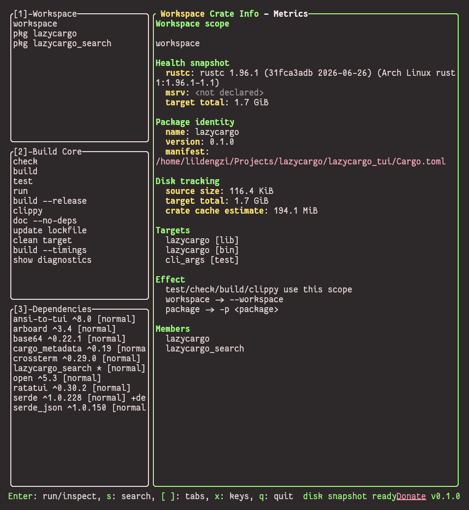
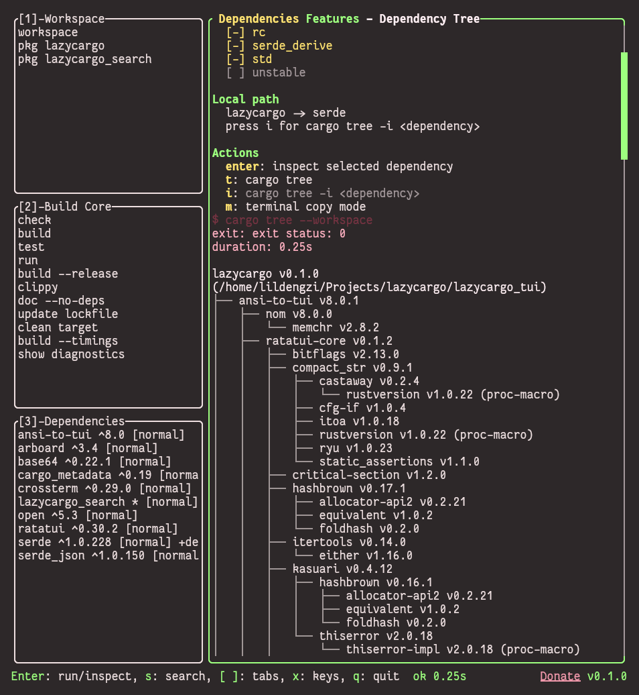
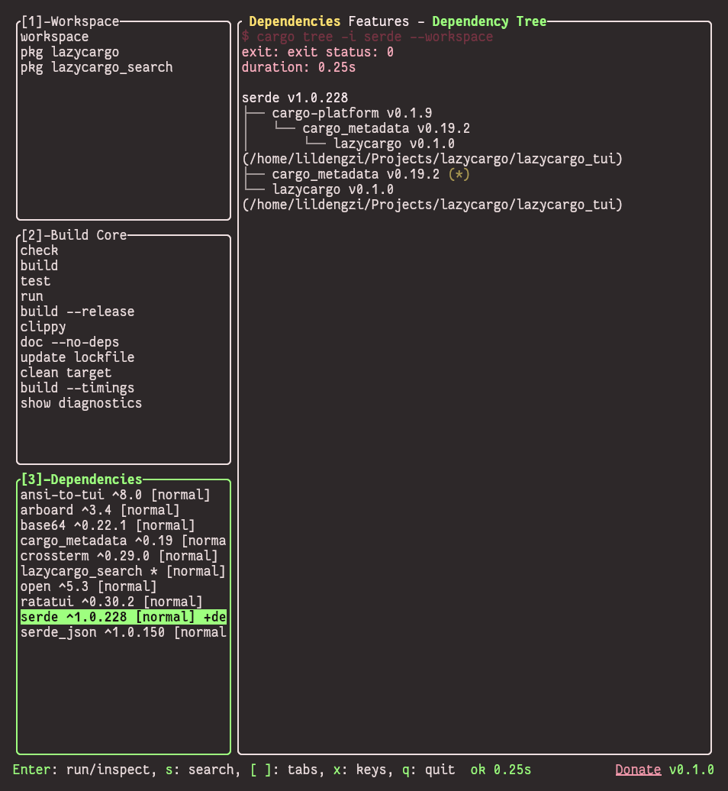
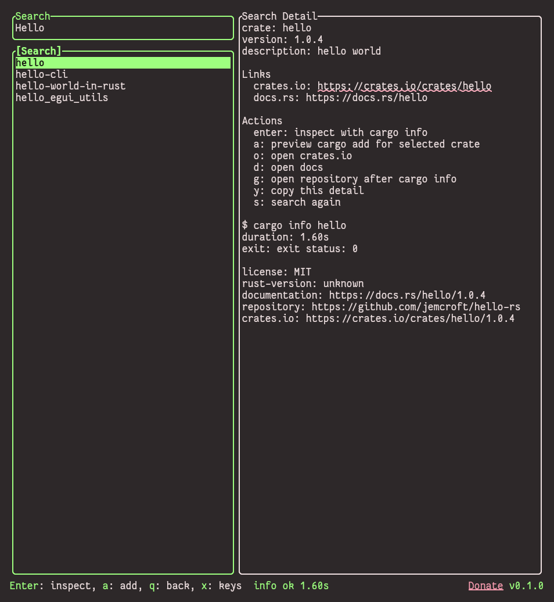

# lazycargo

<p align="center">
  <a href="https://crates.io/crates/lazycargo-tui"></a>
  <a href="https://github.com/lildengzi/lazycargo/blob/main/LICENSE"></a>
  
</p>

<p align="center">
  
</p>

一个面向 Rust 项目的终端 TUI 工具。

用处：查看当前 package 作用域、依赖 features、依赖树、命令输出、构建历史、磁盘占用和 crates.io 搜索。

## 界面预览









## 当前状态

早期开发阶段，但主要 TUI 流程已经可以日常用。

**已实现：**

- 类似 `lazygit` / `lazydocker` 的紧凑 TUI 布局。
- Workspace / package 作用域面板。
- Build Core 面板：`check`、`build`、`test`、`run`、`clippy`、`doc`、`update`、`clean`、`build --timings`。
- Build Core 支持 `cargo new <name>`，通过底部状态栏输入项目名。
- Dependencies 面板，展示直接依赖元数据和 feature 状态：
  - `[x]` 显式或默认启用
  - `[-]` 由 Cargo resolve 结果启用
  - `[ ]` 可用但未启用
- 上下文感知右侧标签页：
  - Workspace: `Crate Info`, `Metrics`
  - Build Core: `Task Config`, `Live Output`
  - Dependencies: `Features`, `Dependency Tree`
- 右侧瀑布屏支持持久输出、ANSI 颜色解析、语义着色、滚动条、键盘/鼠标滚动。
- `cargo tree` 和 `cargo tree -i <crate>` 输出到 Dependency Tree 视图。
- 类 pacseek 的 crates.io 搜索页，优先使用 crates.io API，失败时回退到 `cargo search`，并支持 `cargo info` 检查。
- 支持打开 crates.io / docs / repository 链接。
- `m` 切换终端复制模式，释放鼠标捕获以便拖选文字。
- `y` 复制搜索详情。
- 核心 Cargo 动作已流式、非阻塞（`check`、`build`、`test`、`run`、`tree` 等）。命令执行时 TUI 仍然可以操作。
- 非 Cargo 项目目录进入 limited mode，可直接用 `cargo new <name>` 创建项目。

**尚未完成：**

- 结构化的交互式依赖图节点。
- 点击展开/折叠依赖树。
- 依赖冲突路径高亮。

## 安装与运行

```bash
cargo install lazycargo-tui
lazycargo
```

crates.io 上的发布包名是 `lazycargo-tui`，安装后的命令仍然是 `lazycargo`。

或从源码构建：

```bash
git clone https://github.com/lildengzi/lazycargo
cd lazycargo
cargo build --release
./target/release/lazycargo
```

把 binary 放到 `PATH` 里就能全局启动，和 `lazygit`、`lazydocker` 一个用法。

不带参数运行会打开 TUI。也可以用命令预览模式：

```bash
lazycargo check --workspace
lazycargo build -p lazycargo-tui --release
lazycargo add serde_json --features preserve_order
```

## 快捷键

**主界面：**

- `1`, `2`, `3`: 聚焦 Workspace、Build Core、Dependencies。
- `0`: 聚焦右侧瀑布屏。
- `Tab`: 循环切换焦点。
- `Enter`: 执行或检查当前选中项。
- `[`, `]`: 切换当前面板对应的右侧子标签。
- `j/k` 或方向键：移动选择；右侧聚焦时滚动输出。
- `PgUp/PgDn`: 滚动右侧瀑布屏。
- `c`: 执行 `cargo check`。
- `b`: 执行 `cargo build`。
- 在 Build Core 选中 `new project` 后按 `Enter`：输入项目名，再按 `Enter` 执行 `cargo new <name>`。
- `t`: 执行 `cargo tree`。
- `i`: 执行 `cargo tree -i <selected dependency>`。
- `s`: 打开 crates.io 搜索页。
- `/`: 过滤当前左侧面板。
- `m`: 切换终端复制模式。
- `x`: 显示快捷键帮助。
- `q`: 退出，或从搜索页返回。

**搜索页：**

- 输入关键词后按 `Enter` 搜索。
- `j/k` 或方向键移动结果选择。
- `Enter`: 使用 `cargo info` 检查当前 crate。
- `a`: 预览 `cargo add <crate>`。
- `o`: 打开 crates.io。
- `d`: 打开文档。
- `g`: 打开仓库。
- `y`: 复制当前详情文本。
- `q`: 返回主界面。

## 工作区结构

```text
lazycargo/
├── Cargo.toml
├── lazycargo_tui/
│   ├── Cargo.toml
│   └── src/
└── lazycargo_search/
    ├── Cargo.toml
    └── src/
```

- `lazycargo_tui`: 终端 UI、workspace 元数据、cargo 动作、依赖树输出、命令输出，以及最终 `lazycargo` 二进制。
- `lazycargo_search`: crates.io 搜索状态、结果解析和包详情格式化。

## 开发

```bash
cargo fmt --check
cargo clippy --workspace --all-targets -- -D warnings
cargo test --workspace --all-targets
cargo build --workspace --release
```

## 致谢

- [lazygit](https://github.com/jesseduffield/lazygit) — TUI 布局灵感。
- [lazydocker](https://github.com/jesseduffield/lazydocker) — 更多 TUI 布局灵感。
- [pacseek](https://github.com/moson-mo/pacseek) — 搜索页流程灵感。

## 许可证

MIT，见 [LICENSE](LICENSE)。

## Star 趋势

[](https://www.star-history.com/#lildengzi/lazycargo&Date)
